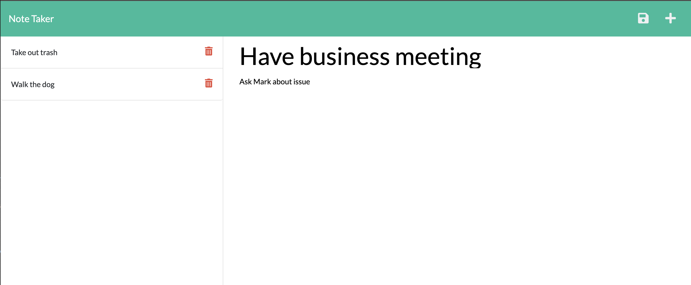

# My Note Entry


## Table of Contents

* [Description](#description)
* [Installation](#installation)
* [Code Example](#code-example)
* [Notes Landing Page](#notes-landing-page)
* [Usage](#usage)
* [License](#license)
* [Questions](#questions)


## Description
A quick and easy to use note taking app that allows you to add new notes with a spot to add descriptions of each note. Additionally you can also delete the note when it's no longer needed. The site opens the the homepage, and when ready just click to add a new note.

## Installation
This app has no need for installation as it is live deployed to a site

## Code Example
Below is an example of code that creates a new note, with the addition to the code the allows for notes to be deleted
```JS
api.post('/', (req, res) => {
    const {title, text } = req.body;
    if (req.body) {
        const newNote = {
            title,
            text,
            id: uuid(),
        };

        readAndAppend(newNote, './db/db.json');
        res.json('Note added. ');
    } else {
        res.error('Error adding new note. ');
    }
});
// refers to the specific note id to delete
api.delete('/:id', (req, res) => {
    const { id } = req.params;
    if (id) {
        readFilterAppend('./db/db.json', id);
        res.json('Notes deleted. ');
    } else {
        res.error('Error deleting note. ');
    }
});
```


## Notes Landing Page
Bellow is a screenshot of the landing page



## Usage
To use the notes site visit the deployed page link. When the site first opens you will be greeted with the note taker homepage and when ready click on the "Get Started" button which will take you to the note taking landing page. Next simply enter the title of the note and a description, when done click on the save icon in the top right of the screen. Your new note will be displayed in the column to the left of the page. Any additional note will be added to the list. When the note is no longer needed, simply click the garbage option to deleted the desired note. If for any reason you need to go back to the homepage, simply click "Note Taker" in the top left of the screen.


## License


For additional information on this license please use the provided link
https://choosealicense.com/licenses/mit/

## Questions
Github: https://github.com/jonnyboy808


